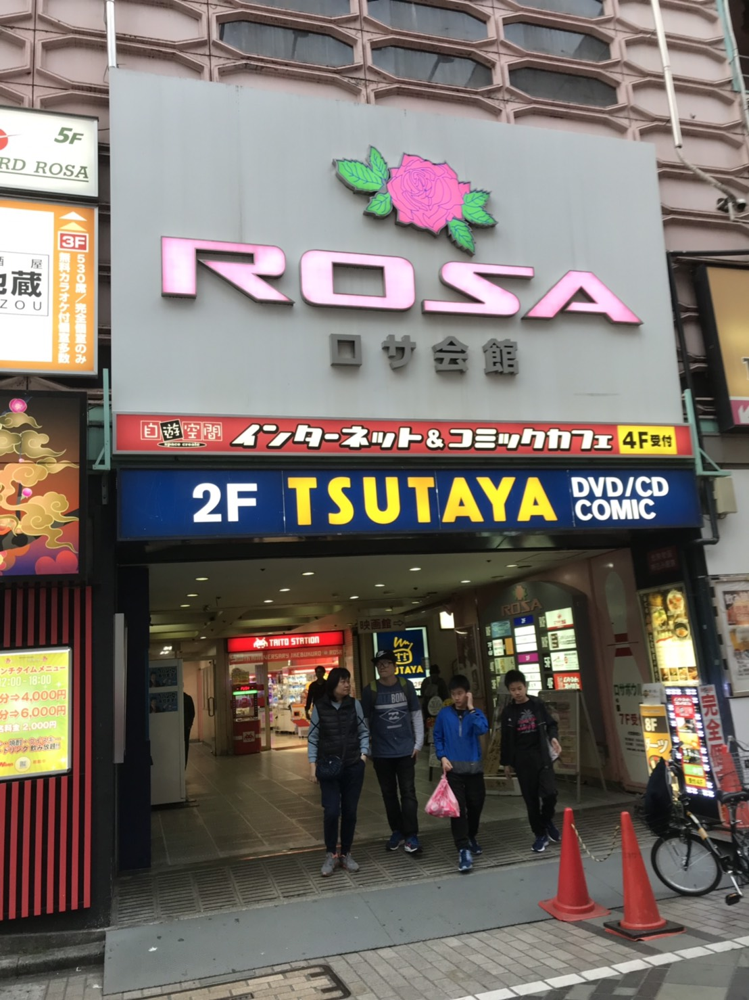
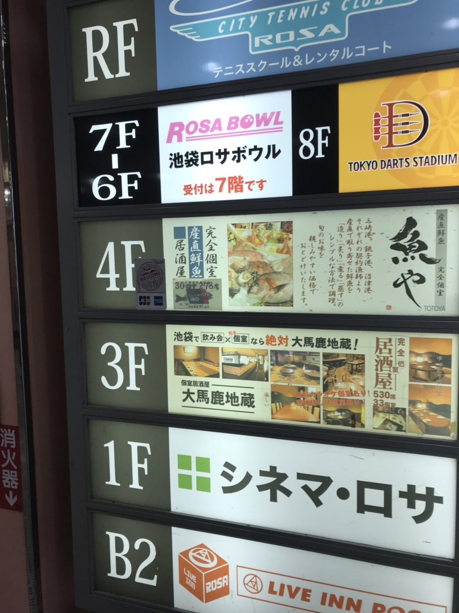
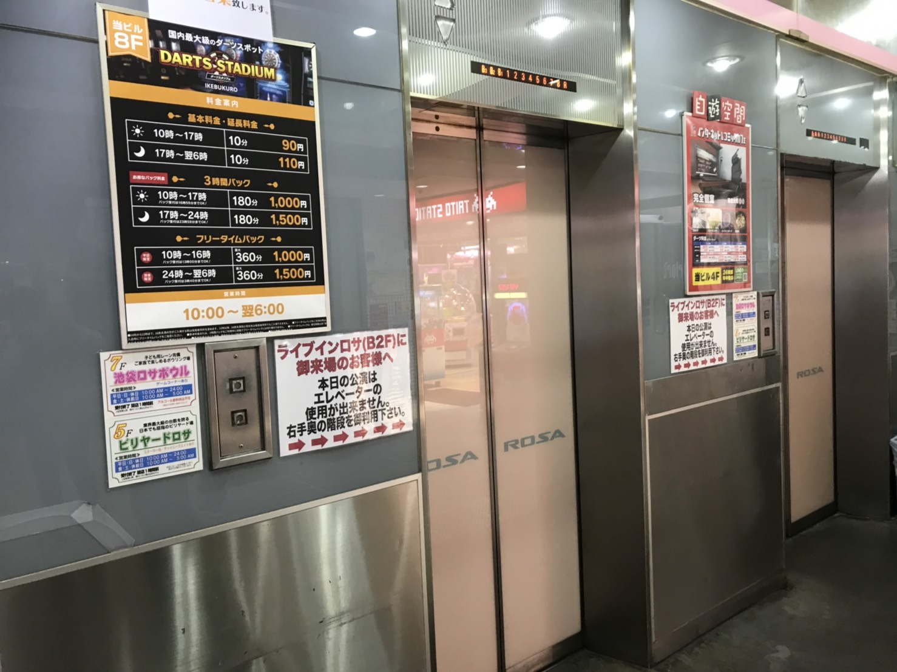
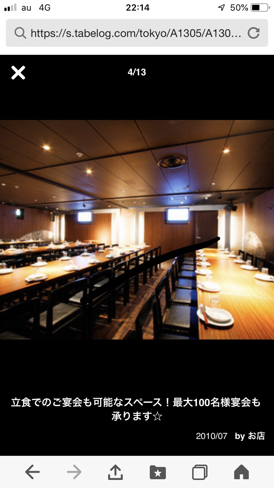
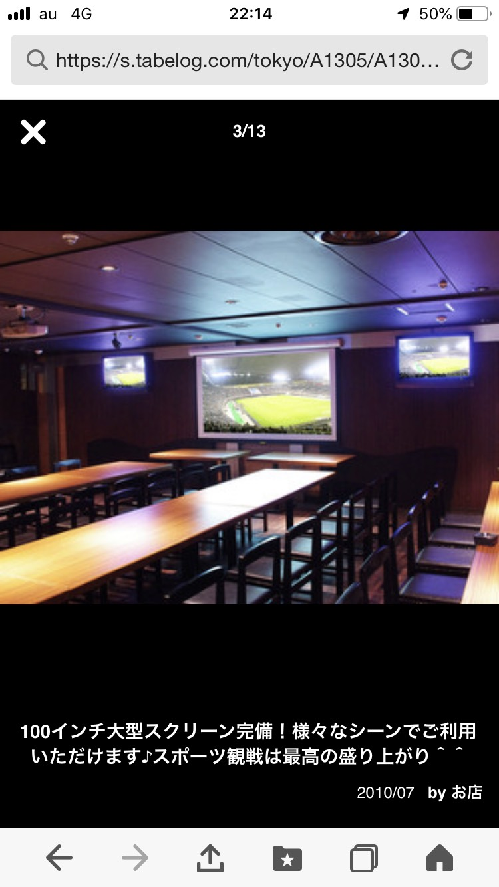
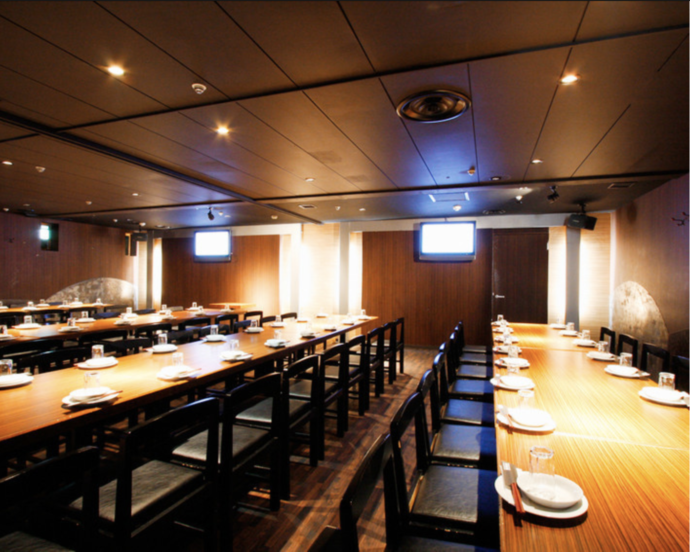

# jizou
<html lang="ja">
 <head>

  <meta charset="utf-8">
<meta http-equiv="x-ua-compatible" content="ie=edge">
<meta name="description" content="都立大泉高校30期同期会、二次会会場画像集" />
<meta name="google-site-verification" content="..." />
<meta name="msvalidate.01" content="..." />
<meta name="format-detection" content="telephone=no">
<meta name="viewport" content="width=device-width, initial-scale=1">
 

<link href="https://cdnjs.cloudflare.com/ajax/libs/lightbox2/2.7.1/css/lightbox.css" rel="stylesheet">
   
</head>
<!--
<body onload="alert('30期同期会会場「アルテアトロ」〜〜(^o^)/')" onunload="alert('再会の時まで、元気でお過ごしくださいませ〜(^o^)/')">
-->
<h1><marquee behavior="alternate">〜!!!!!! 2019/06/01_都立大泉高校、30期同期会二次会会場「大馬鹿地蔵」 !!!!!!〜</marquee></h1>

<a href="https://torokoid.github.io/home">Home</a>><a href="https://torokoid.github.io/oizumi">30期同期会</a>>大馬鹿地蔵

  モバイル端末をお使いの場合は、画面を横向きにするとより見やすくご覧頂けます。

                              

 
<h2>
<a href="https://tabelog.com/tokyo/A1305/A130501/13033804/" target="_blank">お店食べログリンク、お店自体のHPはセキュリティー上の問題があるのでリンクせず</a>
</h2>
                  
<section>
<!-- begin wwww.htmlcommentbox.com -->
 
<a href="http://www.htmlcommentbox.com">HTML Comment Box</a> is loading comments...

 <link rel="stylesheet" type="text/css" href="//www.htmlcommentbox.com/static/skins/bootstrap/twitter-bootstrap.css?v=0" />
 
<!-- end www.htmlcommentbox.com -->
</section>

                             
          

<a href="https://torokoid.github.io/oizumi">大泉高校30期のHP　← リンク</a>

  

<!-- フッタ -->
 <footer>
 Copyright 2019/04/24 Pe-Young(S.Hada)
 </footer>
